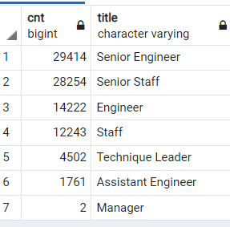

# Pewlett-Hackard-Analysis

## Overview 
The purpose of the analysis was two-fold: one was to to determine the number of retiring employees per title, and the second was to identify employees who are eligible to participate in a mentorship program. 

## Results
**Purpose 1: Number of retiring employees per title**

I queried the existing tables and created a new table filtered by people whose birth dates are between 1952 and 1955, or those who are likely to retire soon. Here are the results:

  


- The company will have the largest  shortage of these types of workers:
- Engineer
  - Senior Staff
  - Staff
- The company will have a large shortage of these types of workers:

  - Senior Engineer
  - Assistant Engineer
  - Technique Leader
- The company will have hardly any Manager positions vacated.
- The total number of soon-to-be retirees is 90,398.

**Purpose 2: Employees eligible to participate in a mentorship program**

I queried the existing tables and created a new table filtered by current employees whose birth dates are in 1965, or those who are about 55 years old. 

- There were 1549 total employees who are eligible to participate in a mentorship program. 

- Of the total, there were 748 Engineers of some type.

- Of the total, there were 724 Staff Members of some type.
- Of the total, there were 77 Technique Leaders.

## Summary
From the data, I can draw these conclusions:

- The company will have a large shortage of various positions (especially Engineers and Staff Members) very soon, and they need to get hiring!

- To assist HR in the hiring process, we could build a table which only shows the engineering positions. It's based on retiring_titles:
````
    SELECT count, title
    INTO engineering_titles
    FROM retiring_titles
    WHERE title IN ('Engineer','Senior Engineer','Assistant Engineer');
````
- It may be beneficial for HR to see the salaries and gender of the people in the mentorship program. This is an aside, but it could be shared to assist them in making sure there is pay equity at the company. This table is based on mentorship_eligibility, but is augmented to show salaries and gender as well:
````
	SELECT DISTINCT ON (e.emp_no) e.emp_no, e.first_name, e.last_name, e.birth_date, e.gender,
	de.from_date, de.to_date,
	t.title,
	s.salary
	INTO mentorship_eligibility_salary
	FROM employees as e LEFT JOIN
	dept_emp as de ON (e.emp_no = de.emp_no) LEFT JOIN
	titles as t ON (e.emp_no = t.emp_no) LEFT JOIN
	salaries as s on (e.emp_no = s.emp_no)
	WHERE (e.birth_date BETWEEN '1965-01-01' AND '1965-12-31') AND (de.to_date = '9999-01-01')
	ORDER BY e.emp_no;
````

